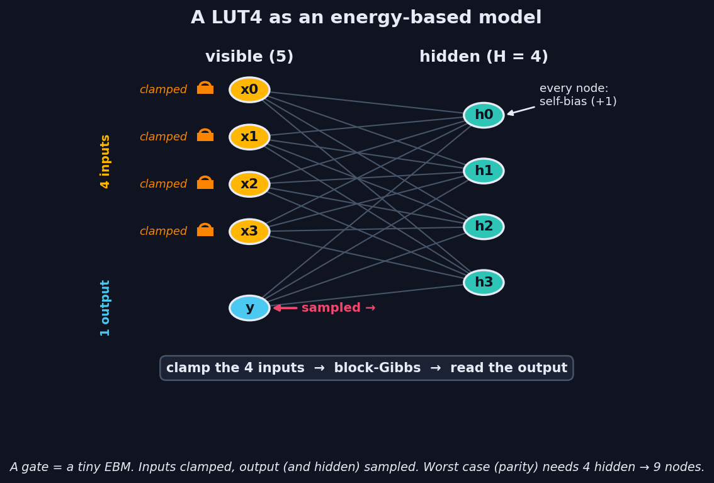
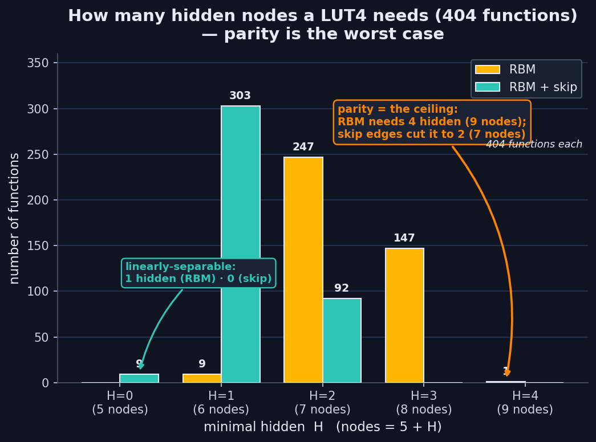
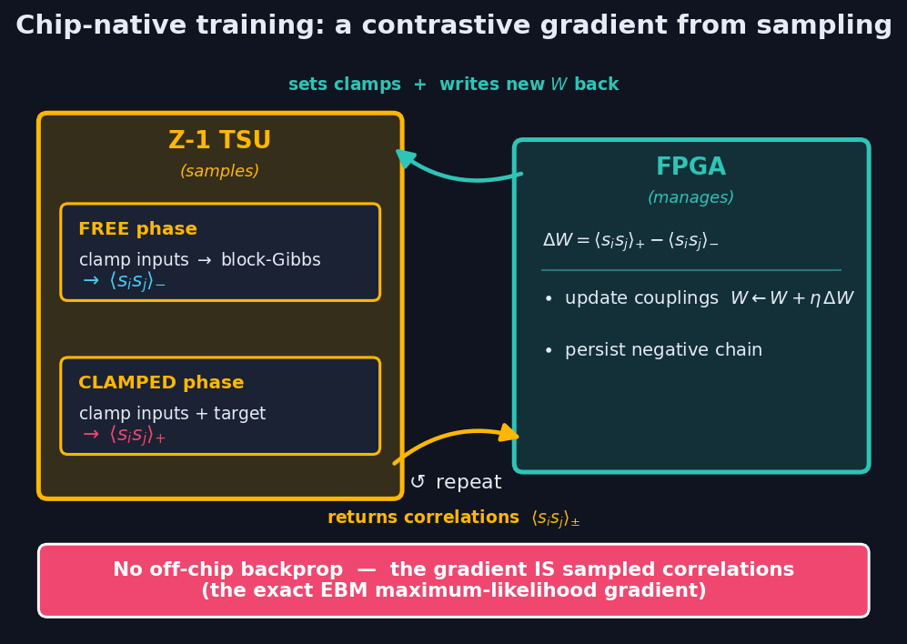
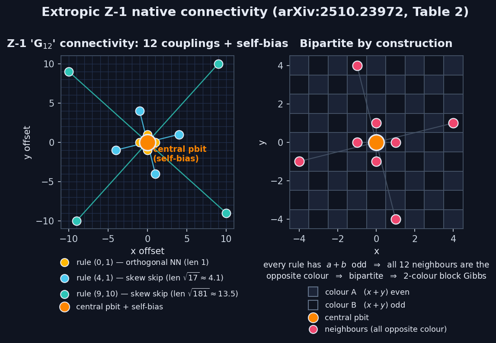
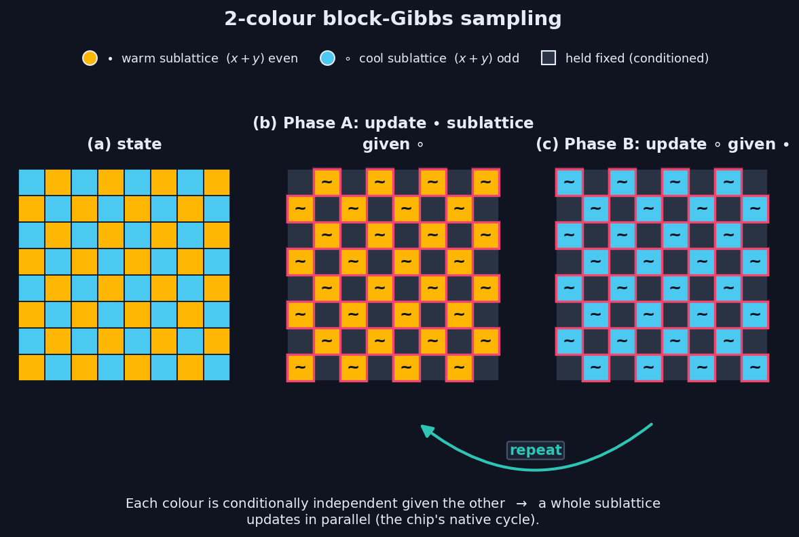
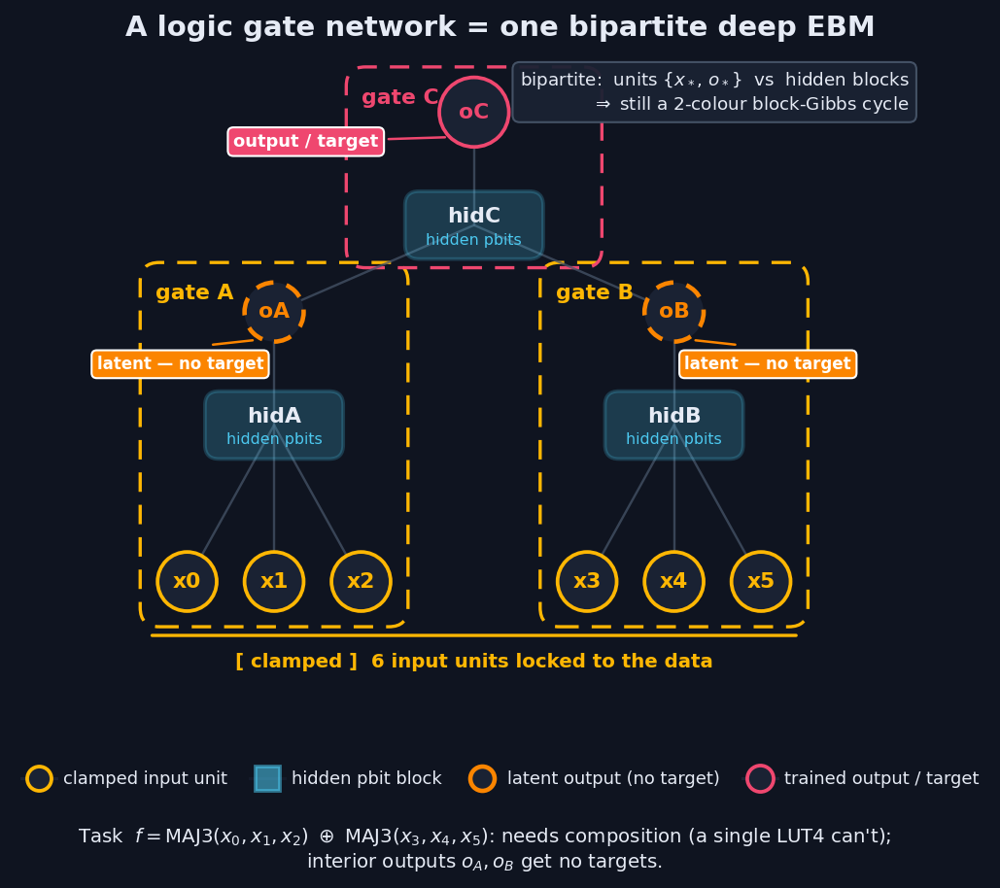

# ⚡ PLGN — Probabilistic Logic Gate Networks on Extropic's Z-1

*Paving the way toward **hybrid systems that pair high-throughput FPGA logic with probabilistic computing** — and learn the logic on the probabilistic hardware itself, with no off-chip backprop.*

## The vision — FPGA logic + probabilistic computing, in synergy

The goal isn't one magic fabric — it's a **synergy between two complementary kinds of hardware**: conventional **FPGA logic** for high-throughput deterministic compute, and Extropic's **probabilistic chip (TSU)** for native sampling and inference.

**Starting point (Guillaume Verdon, Extropic):** *today* it already makes sense to **pair standard neural networks with probabilistic computing** — the TSU does the sampling-heavy inference, a conventional net does the rest.

**The trajectory we chart from there:**
1. move those **auxiliary networks onto FPGAs** (cheaper, higher-throughput, deployable beside the chip);
2. turn those FPGA networks into **Logic Gate Networks (LGNs)** for **maximum throughput** — logic gates are exactly what FPGAs are made of;
3. **train the combined FPGA + probabilistic system on the hardware itself**, end to end.

**This repo takes the first step on that path.** It builds the missing bridge between *logic gates* and the *probabilistic substrate*: a logic gate is a **cheap energy-based model** (~9 nodes, parity the ceiling), and such a gate can be **trained and run by the probabilistic chip's own sampling — in place, with no off-chip backprop**. On-hardware, sampling-based learning of logic is precisely the seed of the **final step** — co-training an FPGA-side LGN together with the probabilistic system, on the hardware.

What we validate here:
1. a **logic gate is a cheap EBM** — any 4-input gate in ~9 nodes (*How many nodes*, below);
2. a logic gate **trained *and* executed on the probabilistic chip's sampler** — 16/16, no backprop (*Training & running*, below);
3. on a **faithful model of Z-1's native connectivity**, with a live simulator (*The substrate*, near the end).

## Why probabilistic logic gates? — the limits of LGN training, lifted

Differentiable **Logic Gate Networks** (Petersen et al., 2022) are a great idea — learn the logic, then run it as raw gates — but their *training* recipe carries real limits:

- **Fan-in capped at 2.** Each gate is a softmax over all `2^(2^k)` truth tables — 16 for 2-input gates, but **65,536 for 4-input** (double-exponential). So LGNs are built from tiny 2-input gates and must go **very deep** to be expressive, which makes them hard to train and to route.
- **A relaxation → discretization gap.** Training blends all gates on relaxed inputs; deployment `argmax`-es to hard gates. The mismatch costs accuracy and needs careful temperature / straight-through tricks.
- **Training ≠ where inference runs.** It needs **full backprop on GPUs**; the FPGA/ASIC that *runs* the gates can't *learn* them — no in-place or online adaptation on the deployment hardware.
- **Deterministic only.** A trained LGN is a fast Boolean function — no native uncertainty, priors, or sampling.

**The probabilistic / energy-based formulation lifts each of these:**

| LGN training problem | This approach |
|---|---|
| softmax over `2^(2^k)` tables ⇒ fan-in ≤ 2 | gate = `O(k·H)` couplings, trained on its `2^k` rows ⇒ **4-input gates directly**, fewer & shallower |
| relaxation → discretization gap | **the EBM *is* the gate** — sharpen by *temperature*, no separate discretization step |
| backprop on a different machine | gradient = **sampled correlations**, computed by the **same chip** that runs it — in place, no backprop |
| deterministic only | it's a **sampler** — the same fabric yields uncertainty, priors, generative inference |

And it enables the endgame of the trajectory above: **learn the logic on the probabilistic hardware, then run it for throughput on FPGAs.** Because the gradient is *sampled correlations* rather than backprop, the **probabilistic system can learn the logic in place**, and the learned gates deploy onto high-throughput FPGA fabric — the bridge to **co-training a combined FPGA-LGN + probabilistic system on the hardware**, which a backprop-on-GPU, deterministic LGN pipeline cannot do. (The expensive step — sampling — is performed by the TSU in physics; Extropic projects up to ~10,000× lower energy than GPUs.)

## A logic gate as an energy-based model

A LUT4 (any Boolean function of 4 bits) becomes an EBM with **5 visible nodes** (4 inputs + 1 output) + **H hidden** nodes. You *use* it by **clamping the inputs and sampling the output** — the chip's clamp-and-block-Gibbs flow.



## How many nodes does a logic gate need?

Across **404 functions** the minimal hidden count is tiny and bounded, and **parity is the provable worst case** (maximally non-linear — no linear or low-order handle). A plain EBM needs **≤4 hidden (9 nodes)**; adding direct input→output **skip edges** halves the worst case to **2 hidden (7 nodes)** and collapses linearly-separable functions to **0 hidden**. The parity floor of 4 is real, not an optimization artifact — a **512-restart probe shows H≤3 provably can't**.



| | linearly-separable | typical | worst case (parity) |
|---|---|---|---|
| **Ideal EBM** | 1 hidden / 6 nodes | 2–3 / 7–8 | **4 / 9 nodes** |
| **+ skip edges** | **0 / 5 nodes** | 1 / 6 | **2 / 7 nodes** |

Every circuit stays within the Z-1 **≤12-coupling** budget.

## ★ Training & running a logic gate on the chip

The headline result: we learn a 4-input gate **and execute it on the chip's own sampler**, FPGA-managed, with **no off-chip backprop** — because the exact maximum-likelihood gradient of an EBM is a **difference of sampled correlations**, `ΔWᵢⱼ = ⟨sᵢsⱼ⟩₊ − ⟨sᵢsⱼ⟩₋`, which is exactly what the chip produces.



**Conditional contrastive divergence** (inputs clamped in both phases, so we train `P(output|inputs)` = the LUT):
- **Positive phase (exact, FPGA-side):** clamp inputs **and** target output; the hidden mean is closed-form `tanh(β(c+ΣvW))` — zero variance, no sampling.
- **Negative phase (on the chip):** clamp inputs only; let output + hidden run free and **block-Gibbs sample on THRML** (the 2-colour cycle). Read the correlations off the samples.
- **Update (FPGA):** moment difference → Adam step on the couplings → write back. Repeat.

| | parity (worst case) | verified |
|---|---|---|
| **Ideal EBM** (exact gradient) | **9 nodes** (4 hidden) | 16/16 exact |
| **On-chip** (THRML block-Gibbs, sampling-trained) | **13 nodes** (8 hidden) | **16/16** — clamp inputs → sample → correct output |

The **9 → 13 gap is a clean, measured finding**: training by *physical sampling* instead of an exact gradient costs ≈4 extra hidden nodes (the sampled gradient is noisier). Both fit the 12-coupling budget (max degree ≤ 8).

### Complexity vs. standard (differentiable) LGNs

| | differentiable LGN (softmax/argmax over tables) | this EBM-LUT (chip-native) |
|---|---|---|
| gate parameters | categorical over **`2^(2^k)`** tables | **`O(k·H)`** couplings |
| k=2 / **k=4** | 16 / **65,536** per gate | ~13 / **~53** per gate |
| fan-in scaling | **double-exponential** → locked to k=2 | **polynomial** → k=4 in one gate |
| gradient | exact **backprop** (autodiff, off-chip GPU) | **sampled** `⟨ss⟩₊−⟨ss⟩₋` (on-chip, no backprop) |
| inference / gate | **O(1)** hard logic (post-argmax) | **O(K·edges)** block-Gibbs (done in physics) |

A 4-input gate is **one ~9–13-node model trained on 16 rows** — no table enumeration, no exponential. The trade is sampling-based training/readout instead of exact backprop + O(1) gates — and that sampling is exactly what the thermodynamic chip performs in physics.

## Results at a glance
- **Any 4-input logic gate ≤ 9 nodes** ideal (7 with skip edges); **parity is the proven ceiling** (404-function sweep + 512-restart floor probe).
- **A LUT4 trained and executed on the chip's sampler, 16/16, no backprop, 13 nodes** — quantifying the **+4-node cost of sampling-based training**.
- **Sidesteps the double-exponential table cost of LGN training** (k=4 directly), and the expensive step (sampling) is what Z-1 accelerates in physics.
- All within the **≤12-coupling** hardware budget.

## Repository layout

| Path | What |
|---|---|
| [lut4_thrml_train.py](lut4_thrml_train.py) | **★ Single LUT4 trained chip-native via THRML sampling — 16/16** |
| [lut4_thrml.py](lut4_thrml.py) | LUT4 capacity (exact) + THRML clamped-sampling inference |
| [lut4_distribution.py](lut4_distribution.py) | Minimal-hidden distribution over 404 functions; EBM vs +skip |
| [lut4_parity_floor.py](lut4_parity_floor.py) | Proves the parity floor = 4 hidden (512-restart probe) |
| [lut4_search.py](lut4_search.py) | Architecture search (1- vs 2-layer hidden arrangements) |
| [lut_lgn*.py](lut_lgn.py) | Multi-gate PLGN experiments (future work) |
| [tsu-sim.html](tsu-sim.html) | Interactive WebGL2 simulator of the G₁₂ grid + 2-cycle block Gibbs |
| [spec.md](spec.md) | Sourced dossier on the Z-1 chip |
| [figures/](figures/) | Dark-mode illustrations (regenerable via `figures/make_*.py`) |
| `thrml-src/` | Cloned THRML (installed editable into `.venv`) |

## Running it

```bash
source .venv/bin/activate          # THRML + JAX (CPU, Apple-Silicon native)
python lut4_thrml_train.py         # ★ train + run a LUT4 on the THRML sampler — 16/16
python lut4_distribution.py        # capacity study (fast, exact)
open tsu-sim.html                  # the interactive G12 simulator
```

---

## The substrate — Z-1 hardware & a live simulator

*(Background on the chip the whole approach targets.)*

Z-1 is Extropic's first production-scale **Thermodynamic Sampling Unit (TSU)**: hundreds of thousands of **pbits** in standard CMOS that sample from programmable Ising/EBM distributions using transistor noise as the entropy source. Sourced dossier: **[spec.md](spec.md)**.

Connectivity is the documented **"G₁₂"** graph (arXiv:2510.23972, Table 2): each pbit couples to **12 neighbours + a self-bias** via three *connection rules* — `(0,1)` nearest-neighbour plus two long-range skew skips `(4,1)`, `(9,10)`. Every rule has odd `a+b`, so the graph is **bipartite** under the `(x+y)` checkerboard ⇒ updates run as a **2-colour block-Gibbs cycle**, the chip's native operation — the same cycle our training and inference ride on.




**[`tsu-sim.html`](tsu-sim.html)** is a self-contained **WebGL2** simulator of a 512×512 Z-1 grid running that 2-colour cycle in real time: dial the strength + directional bias + angle of each of the 3 connection rules and the self-bias, set β (temperature) and an fps cap, and watch domains and anisotropy form. A live stencil shows the 12+1 couplings.

## Future work

The single-gate result and the capacity theory are the foundation; the next frontier is **composing gates into deep probabilistic logic gate networks**, all trained in place on the chip.



- **Deep PLGNs (in progress).** Wiring gates into layers makes interior outputs *latent* — the classic deep credit-assignment problem. A multi-agent design review converged on a fully chip-native recipe (a **variance-reduced sampled-positive estimator** — more samples + Rao-Blackwellised hidden moments + persistent chains + multi-seed evaluation); an early prototype reached **64/64** on a compositional 6-input task, indicating deep networks are trainable on-chip with the right estimator. Productionising this is the main next step.
- **Equilibrium Propagation / Coupled Learning** as a still-more-native deep credit-assignment rule for larger stacks.
- **Routing / embedding** arbitrary inter-gate DAGs onto the fixed G₁₂ lattice (the real density limit at scale).
- **Finite weight-precision** effects on the on-chip gradient.
- **Scale:** ~20k gates per chip / ~150k+ per card at 13 nodes/gate — small-to-mid logic+inference systems today.

## References

- Extropic — *An efficient probabilistic hardware architecture for diffusion-like models*, [arXiv:2510.23972](https://arxiv.org/abs/2510.23972).
- THRML — [github.com/extropic-ai/thrml](https://github.com/extropic-ai/thrml).
- Petersen et al. — *Deep Differentiable Logic Gate Networks*, NeurIPS 2022.
- Hinton — *Training Products of Experts by Minimizing Contrastive Divergence*, 2002 · *A Practical Guide to Training RBMs*, 2012.
- Tieleman — *Persistent Contrastive Divergence*, 2008 · Salakhutdinov & Hinton — *Deep Boltzmann Machines*, 2009.
- Scellier & Bengio — *Equilibrium Propagation*, 2017 · Stern et al. — *Coupled Learning*, 2021.

---
*Built with Claude Code. CPU-only, Apple-Silicon-native JAX. All results reproducible from the scripts above.*
