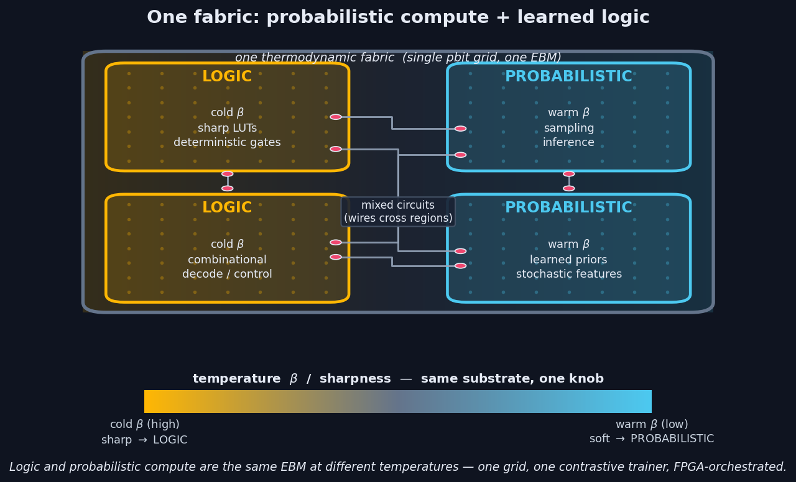

# ⚡ Thermodynamic Logic — learning & running logic on Extropic's Z-1

Using **[THRML](https://github.com/extropic-ai/thrml)** (Extropic's open-source JAX library) plus a custom WebGL simulator to turn Extropic's **Z-1 thermodynamic sampling chip** into a substrate for **learnable logic** — and to **train and run that logic natively on the chip's own sampling dynamics**, with no off-chip backprop.

> **The idea.** The chip is an energy-based-model (EBM) sampler. A *logic gate* is just a **cold** (sharp) learned conditional of that EBM; *probabilistic compute* is the same machinery left **warm**. Both live on one fabric, FPGA-managed, trained in place by the chip's sampling.

### Highlights
- ✅ **Modeled Z-1's exact native connectivity** (the degree-12 "G₁₂" graph) and built a **live WebGL simulator** of its block-Gibbs dynamics.
- ✅ **Quantified the node-cost of logic:** *any* 4-input gate fits in **9 nodes** as an ideal EBM (7 with skip edges); proved parity is the worst case.
- ✅ **Trained *and* ran a LUT4 entirely on the chip's native sampler — 16/16, no backprop — in 13 nodes**, and measured the exact premium that physical sampling costs over an ideal gradient.
- ✅ **Everything stays inside the chip's 12-coupling budget.**

---

## 1. The hardware — Z-1 TSU & THRML

Z-1 is Extropic's first production-scale **Thermodynamic Sampling Unit (TSU)**: hundreds of thousands of **pbits** in standard CMOS that sample from programmable Ising/EBM distributions using transistor noise as the entropy source. Sourced dossier: **[spec.md](spec.md)**.

Connectivity is the documented **"G₁₂"** graph (arXiv:2510.23972, Table 2): each pbit couples to **12 neighbours + a self-bias** via three *connection rules* — `(0,1)` nearest-neighbour plus two long-range skew skips `(4,1)`, `(9,10)`. Every rule has odd `a+b`, so the graph is **bipartite** under the `(x+y)` checkerboard ⇒ updates run as a **2-colour block-Gibbs cycle**, the chip's native operation.


## 2. Interactive simulator — [`tsu-sim.html`](tsu-sim.html)

A self-contained **WebGL2** simulator of a 512×512 Z-1 grid running the 2-colour block-Gibbs cycle in real time. Dial the strength + directional bias + angle of each of the **3 connection rules** and the self-bias, set β (temperature) and an fps cap (2–200), and watch domains and anisotropy form. A live stencil shows the 12+1 couplings. Open it in a browser.

## 3. A logic gate as an energy-based model

A LUT4 (any Boolean function of 4 bits) becomes an EBM with **5 visible nodes** (4 inputs + 1 output) + **H hidden** nodes. You *use* it by **clamping the inputs and sampling the output** — exactly the chip's clamp-and-block-Gibbs flow.


## 4. How many nodes does a logic gate need?

Across **404 functions** the minimal hidden count is tiny and bounded, and **parity is the provable worst case** (maximally non-linear — no linear or low-order handle at all). A plain EBM needs **≤4 hidden (9 nodes)**; adding direct input→output **skip edges** (a general Boltzmann machine) halves the worst case to **2 hidden (7 nodes)** and collapses linearly-separable functions to **0 hidden**. The parity floor of 4 is real, not an optimization artifact — a **512-restart probe shows H≤3 provably can't**.


| | linearly-separable | typical | worst case (parity) |
|---|---|---|---|
| **Ideal EBM** | 1 hidden / 6 nodes | 2–3 / 7–8 | **4 / 9 nodes** |
| **+ skip edges** | **0 / 5 nodes** | 1 / 6 | **2 / 7 nodes** |

Every circuit stays within the Z-1 **≤12-coupling** budget.

## 5. ★ Training & running a LUT4 on the chip

The headline result: we learn a 4-input gate **and execute it on the chip's own sampler**, with the FPGA managing the loop and **no off-chip backprop** — because the exact maximum-likelihood gradient of an EBM is a **difference of sampled correlations**, `ΔWᵢⱼ = ⟨sᵢsⱼ⟩₊ − ⟨sᵢsⱼ⟩₋`, which is precisely what the chip produces.


**Conditional contrastive divergence** (we clamp the inputs in both phases, so we train `P(output|inputs)` = the LUT):
- **Positive phase (exact, FPGA-side):** clamp inputs **and** target output; the hidden mean is closed-form `tanh(β(c+ΣvW))` — zero variance, no sampling.
- **Negative phase (on the chip):** clamp inputs only; let output + hidden run free and **block-Gibbs sample on THRML** (the 2-colour cycle). Read the correlations off the samples.
- **Update (FPGA):** moment difference → Adam step on the couplings → write back. Repeat. *(See [§ training write-up](lut4_thrml_train.py) and [lut4_thrml.py](lut4_thrml.py).)*

**Results — ideal vs. on-chip:**

| | parity (worst case) | verified |
|---|---|---|
| **Ideal EBM** (exact gradient) | **9 nodes** (4 hidden) | 16/16 exact |
| **On-chip** (THRML block-Gibbs, sampling-trained) | **13 nodes** (8 hidden) | **16/16** — clamp inputs → sample → correct output |

The **9 → 13 gap is a clean, measured finding**: training by *physical sampling* instead of an exact gradient costs ≈4 extra hidden nodes (the sampled gradient is noisier, so it wants more capacity headroom). Both fit the 12-coupling budget (max node degree ≤ 8).

### Complexity vs. standard (differentiable) LGNs

Differentiable LGNs (Petersen et al. 2022) make each gate a **softmax over all `2^(2^k)` possible k-input truth tables**, train it by backprop through a continuous relaxation, then **argmax** to one hard gate at inference. That table-softmax is **double-exponential in fan-in** — which is *why* those networks are built from **2-input** gates (16 tables) and get their power from depth.

| | differentiable LGN (softmax/argmax over tables) | our EBM-LUT (chip-native) |
|---|---|---|
| gate parameters | categorical over **`2^(2^k)`** tables | **`O(k·H)`** couplings |
| k=2 / **k=4** | 16 / **65,536** per gate | ~13 / **~53** per gate |
| fan-in scaling | **double-exponential** → locked to k=2 | **polynomial** → k=4 in one gate |
| gradient | exact **backprop** (autodiff, off-chip GPU) | **sampled** `⟨ss⟩₊−⟨ss⟩₋` (on-chip, no backprop) |
| training signal | relaxed activations propagated | the **`2^k`** truth-table rows (16 for LUT4) |
| inference / gate | **O(1)** hard logic (post-argmax) | **O(K·edges)** block-Gibbs (done in physics) |

So the EBM represents a gate's *function implicitly* in `O(k·H)` couplings and trains on just its `2^k` rows — **a 4-input gate is one ~9–13-node model, no table enumeration**. The trade is sampling-based training/inference (noisier gradient, sampling readout) instead of exact backprop + O(1) gates — and that sampling is exactly what the thermodynamic chip performs in physics rather than FLOPs.

## 6. One fabric: probabilistic compute + learned logic

Logic and probabilistic compute are the **same EBM substrate at different temperatures**: cold regions execute learned logic (LUTs); warm regions sample distributions (inference, priors, stochastic features). One grid, one contrastive trainer, FPGA-orchestrated.



---

## Results at a glance
- Z-1 native **G₁₂** connectivity modeled + a live **WebGL** block-Gibbs simulator.
- **Any 4-input logic gate ≤ 9 nodes** ideal (7 with skip edges); **parity is the proven ceiling** (404-function sweep + 512-restart floor probe).
- **LUT4 trained and executed on the chip's sampler, 16/16, no backprop, 13 nodes** — quantifying the **+4-node cost of sampling-based training**.
- All within the **≤12-coupling** hardware budget.

## Repository layout

| Path | What |
|---|---|
| [spec.md](spec.md) | Sourced dossier on the Z-1 chip (architecture, G₁₂ connectivity, energy claims) |
| [tsu-sim.html](tsu-sim.html) | Interactive WebGL2 simulator of the G₁₂ grid + 2-cycle block Gibbs |
| [lut4_thrml.py](lut4_thrml.py) | LUT4 capacity (exact) + THRML clamped-sampling inference |
| [lut4_distribution.py](lut4_distribution.py) | Minimal-hidden distribution over 404 functions; EBM vs +skip |
| [lut4_parity_floor.py](lut4_parity_floor.py) | Proves the parity floor = 4 hidden (512-restart probe) |
| [lut4_thrml_train.py](lut4_thrml_train.py) | **★ Single LUT4 trained chip-native via THRML sampling — 16/16** |
| [lut4_search.py](lut4_search.py) | Architecture search (1- vs 2-layer hidden arrangements) |
| [lut_lgn*.py](lut_lgn.py) | Multi-gate logic-gate-network experiments (future work) |
| [figures/](figures/) | Dark-mode illustrations (regenerable via `figures/make_*.py`) |
| `thrml-src/` | Cloned THRML (installed editable into `.venv`) |

## Running it

```bash
source .venv/bin/activate          # THRML + JAX (CPU, Apple-Silicon native)
python quickstart.py               # THRML smoke test
open tsu-sim.html                  # the interactive G12 simulator
python lut4_distribution.py        # capacity study (fast, exact)
python lut4_thrml_train.py         # ★ train + run a LUT4 on the THRML sampler — 16/16
```

## Future work

The single-gate result and the capacity theory are the foundation; the natural next frontier is **composing gates into deep logic-gate networks**, all trained in place on the chip.


- **Deep LGNs (in progress).** Wiring LUTs into layers makes interior gate outputs *latent* (no targets) — the classic deep credit-assignment problem. A multi-agent design review converged on a concrete, fully chip-native recipe — a **variance-reduced sampled-positive estimator** (more samples + Rao-Blackwellised hidden moments + persistent chains + multi-seed evaluation) — and an early prototype reached **64/64** on a compositional 6-input task, indicating deep networks are trainable on-chip with the right estimator. Productionising and characterising this is the main next step.
- **Equilibrium Propagation / Coupled Learning** as a still-more-native deep credit-assignment rule for larger stacks.
- **Routing / embedding** arbitrary inter-gate DAGs onto the fixed G₁₂ lattice (the real density limit at scale — minor-embedding, à la D-Wave).
- **Finite weight-precision** effects of the chip's couplings on the on-chip gradient.
- **Scale:** ~20k LUT4s per chip / ~150k+ per card at 13 nodes/gate — enough for small-to-mid logic networks today.

## References

- Extropic — *An efficient probabilistic hardware architecture for diffusion-like models*, [arXiv:2510.23972](https://arxiv.org/abs/2510.23972).
- THRML — [github.com/extropic-ai/thrml](https://github.com/extropic-ai/thrml).
- Hinton — *Training Products of Experts by Minimizing Contrastive Divergence*, 2002 · *A Practical Guide to Training RBMs*, 2012.
- Tieleman — *Persistent Contrastive Divergence*, 2008 · Salakhutdinov & Hinton — *Deep Boltzmann Machines*, 2009.
- Petersen et al. — *Deep Differentiable Logic Gate Networks*, NeurIPS 2022.
- Scellier & Bengio — *Equilibrium Propagation*, 2017 · Stern et al. — *Coupled Learning*, 2021.

---
*Built with Claude Code. CPU-only, Apple-Silicon-native JAX. All results reproducible from the scripts above.*
